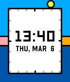

# Halcyon
An analog-digital watchface featuring the solar day, created for [Rebble Hackathon 002](https://rebble.io/hackathon-002/).

### From the darkness, light once again emerges

Halcyon represents the 24 hours of the day as a ring around the edges of your watch, highlighting the sunrise, sunset, and the position of the sun itself!

*Inspired by the PebbleOS 3.9-era sleep visualization! (does anyone remember that?)*

### Features:

* Watch the hours of your day slip away as the sun moves through the 24-hour outer dial
* Select from 10 different exciting color presets
* An absolutely unreasonable amount of color customization! (14 different colors you can customize!)
* Live color themed previews on the settings page!
* No internet connection required! As long as the watchface has communicated with the phone at least once, Halcyon calculates the sunrise and sunset on-device.

### Install it on your watch: 

Download it on the Rebble Store:
https://apps.rebble.io/en_US/application/67cb1c5fb7a02301b9a6e415

Known issues:
 - Config page previews are always square even on round watches
 - The secondary text setting does not currently do anything
 - The screenshots on the app store listing need some work
 - Need to upload source to Github
 - Needs more cool and exciting features
